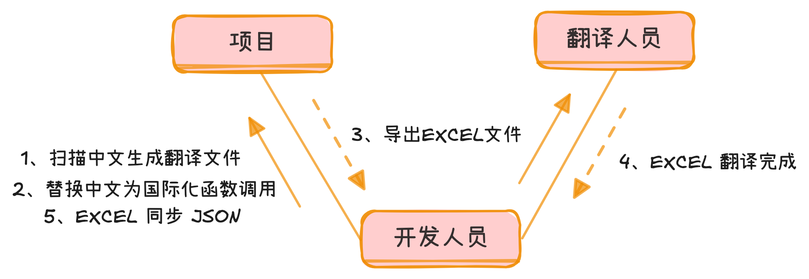
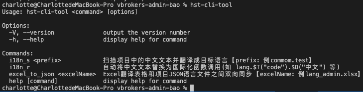
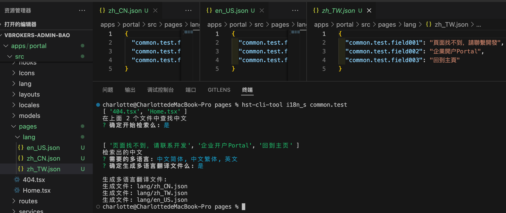
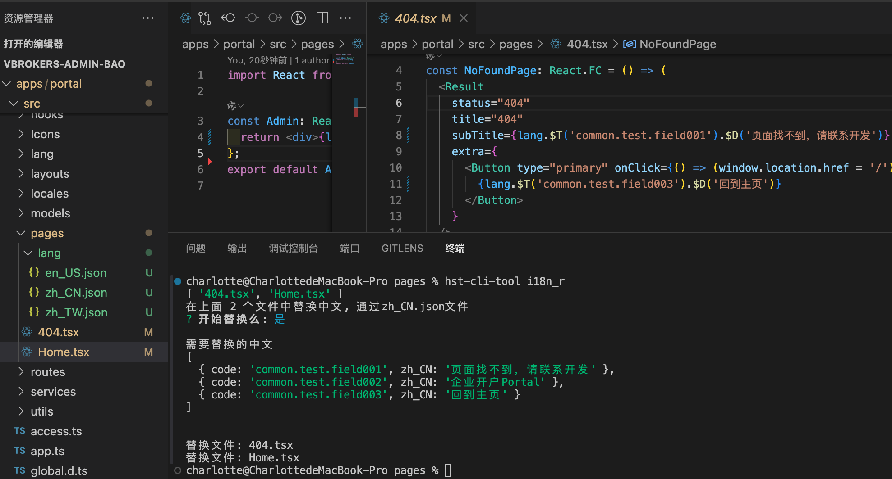
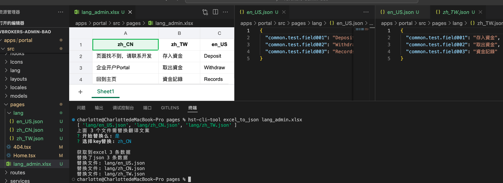

# 命令行工具 hst-cli-tool

**工具名称：国际化助手**

## 简介

`hst-cli-tool `是一个专为前端国际化(i18n)工作流程设计的命令行工具，旨在 `简化`和 `自动化`多语言项目的翻译管理过程。它提供了一系列命令行指令功能，帮助开发者高效处理代码中的多语言文本。

## 主要功能

### **1. 中文文本扫描与翻译**

- 全局扫描项目中的中文文本
- 支持自动翻译成多种目标语言(如 `中文繁体`、`英文` 等)
- 集成翻译引擎

### **2. 智能代码转换**

- 自动将中文文本替换为国际化函数调用(如 `lang.$T().$D()` 等)
- 保留原始代码结构和格式
- 目前只支持 js、ts 的国际化方案，暂时不支持 vue

### **3. Excel 与 JSON 同步**

- 在 Excel 翻译表格和项目 JSON 语言文件之间双向同步
- 自动对比差异并更新翻译
- 支持增量更新

## 工作流程



## 目标用户

- 前端开发人员
- 需要管理多语言项目的团队
- 从单语言项目迁移到国际化项目的团队

## 安装指南

**安装**

```
npm install hst-cli-tool -g
```

**查看命令**

```
hst-cli-tool
```



## 示例

### 1. 中文文本扫描与翻译

```
npx hst-cli-tool i18n_s common.test
```

当在 pages 目录下执行命令后，首先会扫描 pages 文件夹里后缀为【js、ts、jsx、sx】的全部文件；接下来会把文件用工具解析成 ast 树找出中文文本；然后选择要翻译的语言种类【目前提供：中文简体、中文繁体、英文】；最后会生成 json 翻译文件，如图所示：



### 2. 智能代码转换

```
npx hst-cli-tool i18n_r
```

当在 pages 目录下执行命令后，首先会扫描 pages 文件夹里后缀为【js、ts、jsx、sx】的全部文件；接下来找出 pages 文件里是 zh_CN.json 的全部文件得到需要替换的中文和中文 code 码；然后把需要替换的文件中未替换过的中文换成国际化函数调用的格式【`lang.$T().$D()`】，如图所示：



### 3. Excel 与 JSON 同步

```
npx hst-cli-tool excel_to_json lang.xlsx
```

当在 pages 目录下执行命令后，首先会扫描 pages 文件夹里后缀为【json】的全部文件；接下来会找到命令行中输入的 excel 文件【lang_admin.xlsx】，然后选择需要比较的 key【code、zh_CN】，最后比较出不同的就把 json 文件中的替换成 excel 最新的翻译，如图所示：


